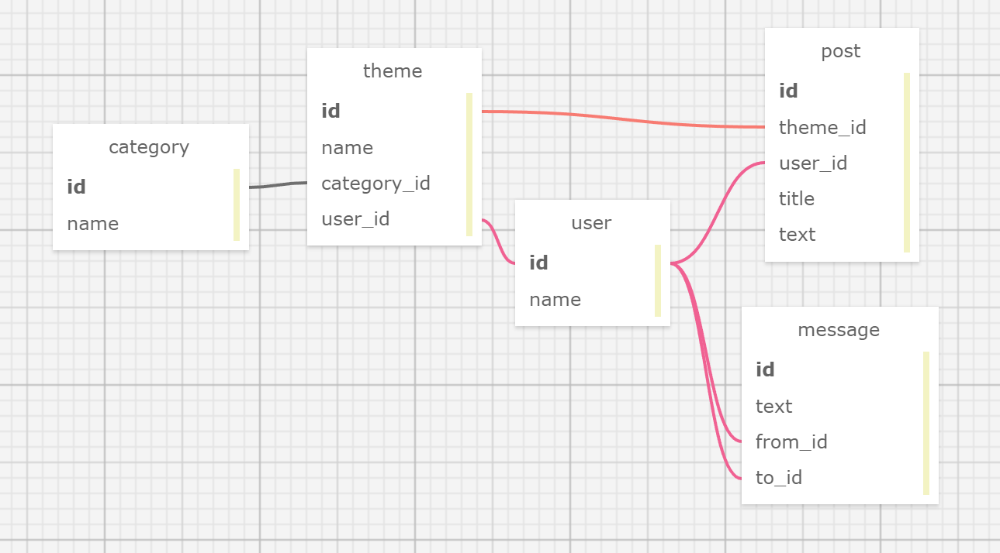
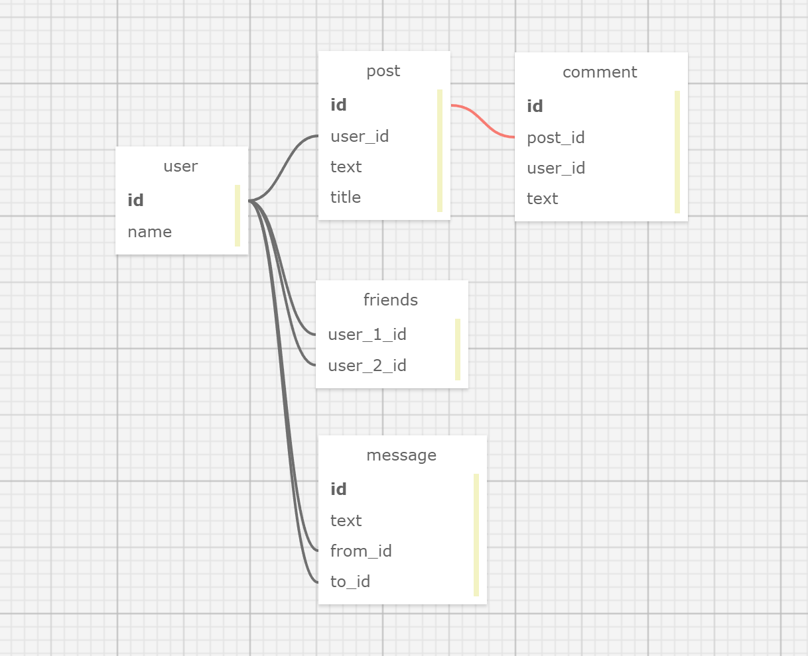
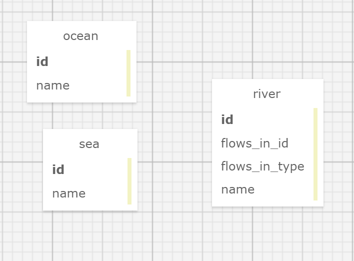
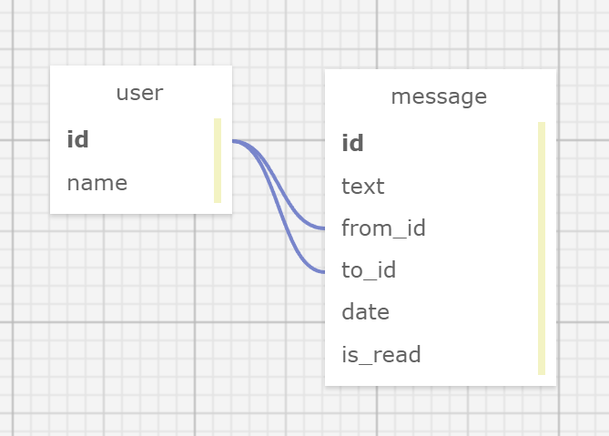
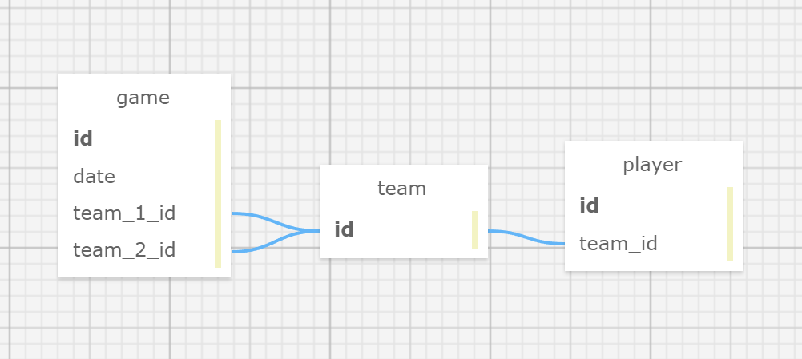
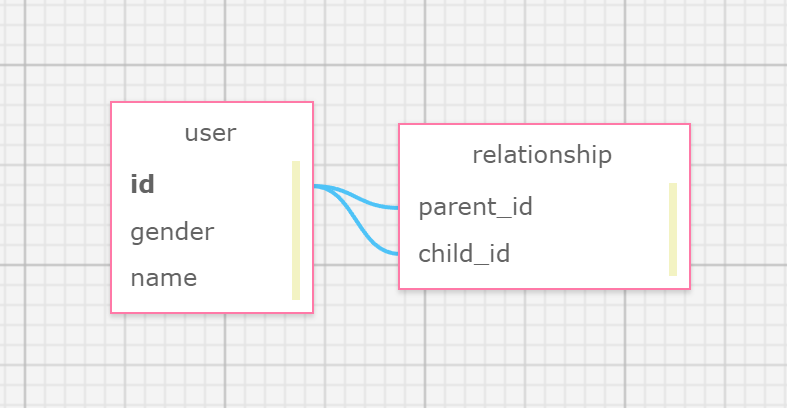

### Получении данных из связанных таблиц
//1
2 таблицы - таблица с названиями категорий и айди категорий товаров, другая с названиями, ценами, количеством товаров и айди категорий
//2
2 таблицы - одна с названиями и айди морей, вторая с названиями реками и айди морей
//3
2 таблицы - одна с названиями и айди стран, вторая с названиями городов и айди стран

### Получении данных из связанных таблиц
SELECT
products.name, categories.name as category_name
FROM
products
LEFT JOIN products ON products.category_id=categories.id

### Цепочка связанных таблиц
//1
3 таблицы - первая: название категорий + айди категорий, вторая: название подкатегорий, айди категорий и айди подкатегорий, третья: с названиями, ценами, количеством товаров и айди подкатегорий
//2
SELECT
products.name,
subcategory.name as subcategory_name,
categories.name as category_name
FROM
products
LEFT JOIN subcategories ON product.category_id=subcategories.id
LEFT JOIN categories ON subcategories.category_id=subcategories.id
//3
SELECT
subcategory.name as subcategory_name,
categories.name as category_name
FROM
subcategories
LEFT JOIN categories ON subcategories.category_id=category.id

### Связывание через таблицу связи
//1
3 таблицы - первая: название категорий + айди категорий, вторая: название подкатегорий, айди категорий и айди подкатегорий, третья: с названиями, ценами, количеством товаров и айди подкатегорий
//2
SELECT
product.name as product_name, category.name as category_name
FROM
product
LEFT JOIN category_product ON category_product.product_id=product.id
LEFT JOIN category ON  category_product.category_id=category.id
//3
<meta charset="utf-8">
<?php
/**
 * @var $link mysqli
 */

require_once('connect.php');

$query = '
SELECT
product.name as product_name, category.name as category_name
FROM
product
LEFT JOIN category_product ON category_product.product_id=product.id
LEFT JOIN category ON  category_product.category_id=category.id
';
$res = mysqli_query($link, $query) or die(mysqli_error($link));

$data = [];
while ($row = mysqli_fetch_assoc($res)) {
$data [] = $row;
}

$res = [];

foreach ($data as $elem) {
$res[$elem['product_name']] [] = $elem['category_name'];
}

echo '<ul>';

foreach ($res as $productName => $productCategories) {
$categoriesString = implode(', ', $productCategories);

    echo "<li>$productName: $categoriesString</li>";
}

echo '</ul>';
?>

### Родственные связи данных
//1
1 таблица с 3 полями - id, name, parent_id
//2
SELECT
category.name as category_name, parent.name as parent_name
FROM
category
LEFT JOIN category as parent ON parent.id=category.parent_id
//3
SELECT
category.name as category_name,
parent.name as parent_name,
grandparent.name as grandparent_name
FROM
category
LEFT JOIN category as parent ON parent.id=category.parent_id
LEFT JOIN category as grandparent ON grandparent.id=parent.parent_id
//4
SELECT
category.name as category_name,
parent.name as parent_name,
grandparent.name as grandparent_name,
grandgrandparent.name as grandgrandparent_name
FROM
category
LEFT JOIN category as parent ON parent.id=category.parent_id
LEFT JOIN category as grandparent ON grandparent.id=parent.parent_id
LEFT JOIN category as grandgrandparent ON grandgrandparent.id=grandparent.parent_id

### Несколько потомков в родственных связях
//1
1 таблица - id, name, father_id, mother_id
//2
SELECT
users.name as user_name,
fathers.name as father_name,
mothers.name as mother_name
FROM
users
LEFT JOIN users as fathers ON fathers.id=users.father_id
LEFT JOIN users as mothers ON mothers.id=users.mother_id
WHERE users.id = 2

### Двойная связь с одной таблицей
//1
2 таблицы - в первой id, name, во второй id, mother_id, father_id

### Практика на организацию баз данных
//1
4 таблицы - 
Первая (статьи) id, name, category_id, text
Вторая (комментарии) id, article_id, user_id, text
Третья (пользователи) id, name
Четвертая (категории) id, name
//2

//3

//4

//5

//6

//7
